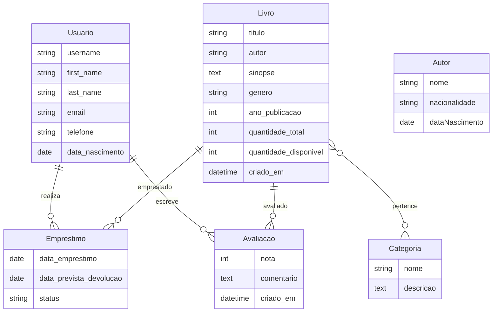

<div align="center">

# 📚 Biblioteca — Sistema de Gerenciamento de Biblioteca


**Sistema web completo para gerenciamento de biblioteca, com controle de acervo, empréstimos, avaliações e cadastro de usuários — desenvolvido com Django 6 e Bootstrap 5.**

Projeto de conclusão de pós-graduação — focado em boas práticas de desenvolvimento web com Python.

---

[Funcionalidades](#-funcionalidades) •
[Tecnologias](#-tecnologias) •
[Instalação](#-instalação) •
[Uso](#-uso) •
[Arquitetura](#-arquitetura) •
[Testes](#-testes) •
[Contribuição](#-contribuição)

</div>

---

## ✨ Funcionalidades

### 📖 Módulo de Autores

| Funcionalidade | Descrição |
|---|---|
| 📋 **Listagem de Autores** | Tabela paginada e interativa com ordenação, powered by `django-tables2` |
| ➕ **Cadastro de Autores** | Formulário com validação automática para inclusão de novos autores |
| ✏️ **Edição de Autores** | Atualização de dados via formulário pré-preenchido |
| 🗑️ **Exclusão com Confirmação** | Modal de confirmação antes da exclusão, evitando remoções acidentais |

### 👤 Módulo de Usuários

| Funcionalidade | Descrição |
|---|---|
| 📝 **Cadastro de Usuários** | Formulário completo com campos de nome, e-mail, telefone, data de nascimento e senha |
| 🔑 **Atribuição de Perfil** | Seleção de grupo/perfil (`Group`) no momento do cadastro para controle de permissões |
| 🔐 **Autenticação** | Sistema de login nativo do Django com modelo de usuário customizado (`AbstractUser`) |
| ✅ **Validação de Senha** | Confirmação de senha com validação cruzada entre os campos |

### 📚 Módulo de Acervo

| Funcionalidade | Descrição |
|---|---|
| 📕 **Gestão de Livros** | Cadastro completo com título, autor, sinopse, gênero, ano de publicação e controle de estoque |
| 🏷️ **Categorias** | Sistema de categorização com relacionamento muitos-para-muitos com livros |
| 📊 **Controle de Disponibilidade** | Rastreamento de quantidade total e disponível de cada livro |
| 🎭 **Gêneros Literários** | 10 gêneros pré-definidos (Ficção Científica, Fantasia, Terror, Romance, Mistério, Biografia, História, Tecnologia, Autoajuda, Outro) |

### 📋 Módulo de Empréstimos e Avaliações

| Funcionalidade | Descrição |
|---|---|
| 🔄 **Empréstimos** | Registro de empréstimos vinculados a usuários e livros, com data prevista de devolução |
| 📈 **Status de Empréstimo** | Controle de estados: Ativo, Devolvido ou Atrasado |
| ⭐ **Avaliações** | Sistema de avaliação de livros com notas de 1 a 5 e comentários opcionais |
| 🚫 **Avaliação Única** | Restrição para uma avaliação por usuário por livro (`unique_together`) |

### 🛡️ Administração e Interface

| Funcionalidade | Descrição |
|---|---|
| 🛡️ **Painel Administrativo** | Interface admin com todos os modelos registrados (Autor, Usuário, Categoria, Livro, Empréstimo, Avaliação) |
| 🔍 **Admin de Autores Avançado** | Busca por nome/nacionalidade, filtros e cálculo automático de idade aproximada |
| 📱 **Design Responsivo** | Layout adaptável a diferentes dispositivos via Bootstrap 5 |
| 🎨 **Templates Padronizados** | Herança de templates com `base.html`, navbar e estilo consistente com `django-bootstrap5` |

---

## 🛠️ Tecnologias

### Back-end
- **[Django 6.0](https://www.djangoproject.com/)** — Framework web Python de alto nível
- **[Python 3.x](https://www.python.org/)** — Linguagem de programação
- **[SQLite](https://www.sqlite.org/)** — Banco de dados relacional embarcado

### Front-end
- **[Bootstrap 5](https://getbootstrap.com/)** — Framework CSS para UI responsiva
- **[django-bootstrap5](https://django-bootstrap5.readthedocs.io/)** — Integração Django + Bootstrap

### Bibliotecas Auxiliares
- **[django-tables2](https://django-tables2.readthedocs.io/)** — Renderização de tabelas HTML com paginação e ordenação

---

## 📁 Arquitetura

```
Estudo/
├── estudo/                         # Configuração do projeto Django
│   ├── settings.py                 # Configurações gerais (DB, apps, i18n)
│   ├── urls.py                     # Rotas raiz do projeto
│   ├── wsgi.py                     # Entry point WSGI
│   └── asgi.py                     # Entry point ASGI
│
├── biblioteca/                     # App principal — Sistema de Biblioteca
│   ├── models.py                   # Modelos: Autor, Usuario, Categoria, Livro, Emprestimo, Avaliacao
│   ├── views.py                    # Class-Based Views (CRUD de autores + cadastro de usuários)
│   ├── urls.py                     # Rotas da app
│   ├── forms.py                    # ModelForms: autor_form, CadastroForm
│   ├── tables.py                   # Configuração de tabelas (django-tables2)
│   ├── admin.py                    # Admin com todos os modelos registrados
│   ├── tests.py                    # Testes unitários
│   └── templates/
│       ├── base.html               # Template base com navbar Bootstrap
│       ├── autor/
│       │   ├── autor_menu.html     # Listagem + modal de exclusão
│       │   └── autor_form.html     # Formulário de criação/edição de autores
│       └── usuarios/
│           └── cadastro.html       # Formulário de cadastro de usuários
│
├── manage.py                       # CLI do Django
├── db.sqlite3                      # Banco de dados SQLite
└── .gitignore                      # Regras de exclusão do Git
```

---

## 🗃️ Modelos de Dados



---

## 🚀 Instalação

### Pré-requisitos

- Python 3.10+ instalado
- `pip` (gerenciador de pacotes Python)
- Git

### Passo a passo

**1. Clone o repositório**

```bash
git clone https://github.com/seu-usuario/projeto-biblioteca.git
cd projeto-biblioteca
```

**2. Crie e ative o ambiente virtual**

```bash
# Windows
python -m venv .venv
.venv\Scripts\activate

# Linux / macOS
python3 -m venv .venv
source .venv/bin/activate
```

**3. Instale as dependências**

```bash
pip install django django-bootstrap5 django-tables2
```

**4. Execute as migrações**

```bash
python manage.py migrate
```

**5. Crie um superusuário (para acesso ao admin)**

```bash
python manage.py createsuperuser
```

**6. Inicie o servidor de desenvolvimento**

```bash
python manage.py runserver
```

**7. Acesse no navegador**

| Recurso | URL |
|---|---|
| Aplicação | [http://localhost:8000](http://localhost:8000) |
| Cadastro de Usuários | [http://localhost:8000/cadastro](http://localhost:8000/cadastro) |
| Painel Admin | [http://localhost:8000/admin](http://localhost:8000/admin) |

---

## 💻 Uso

### Listagem de Autores

A página inicial exibe uma tabela paginada com todos os autores cadastrados. Cada registro possui botões de **Editar** e **Excluir**.

### Cadastro de Autores

Clique em **"Incluir novo autor"** para acessar o formulário de cadastro. Preencha os campos obrigatórios:

- **Nome** — Nome completo do autor
- **Nacionalidade** — País de origem
- **Data de Nascimento** — Formato dd/mm/aaaa

### Edição de Autores

Clique no nome do autor na tabela ou no botão **Editar** para modificar os dados.

### Exclusão de Autores

Clique em **Excluir** para abrir o modal de confirmação. Confirme a exclusão clicando em **"Sim, excluir"**.

### Cadastro de Usuários

Acesse `/cadastro` para criar uma nova conta. Preencha:

- **Usuário** * — Nome de login
- **Senha** * e **Confirmar Senha** * — Senha com confirmação cruzada
- **Perfil** * — Grupo de permissões atribuído ao usuário
- **Nome**, **Sobrenome**, **E-mail** — Dados pessoais (opcionais)
- **Telefone**, **Data de nascimento** — Campos extras do modelo customizado

> Campos marcados com `*` são obrigatórios.

### Painel Administrativo

Acesse `/admin` com as credenciais de superusuário para gerenciar todos os módulos:

- **Autores** — Busca por nome e nacionalidade, filtros por nacionalidade/data, cálculo automático de idade
- **Usuários** — Gerenciamento de contas e grupos
- **Livros** — Cadastro e controle de estoque do acervo
- **Categorias** — Organização do acervo por categorias
- **Empréstimos** — Registro e acompanhamento de empréstimos
- **Avaliações** — Visualização das avaliações de livros

---

## 🧪 Testes

O projeto inclui testes unitários para formulários e views.

```bash
# Executar todos os testes
python manage.py test

# Executar com verbosidade
python manage.py test -v 2

# Executar testes específicos
python manage.py test biblioteca.tests.AutorFormTest
python manage.py test biblioteca.tests.AutorViewTest
```

### Cobertura dos Testes

| Classe | Cenário |
|---|---|
| `AutorFormTest` | Verifica a inicialização do formulário e presença dos campos |
| `AutorViewTest` | Valida a view de criação (status code e template utilizado) |

---

## 🏗️ Padrões de Projeto

- **MVT (Model-View-Template)** — Arquitetura padrão do Django
- **Class-Based Views (CBVs)** — Views genéricas para operações CRUD (`CreateView`, `UpdateView`, `DeleteView`, `SingleTableView`)
- **Template Inheritance** — Template base (`base.html`) com blocos reutilizáveis
- **Modelo de Usuário Customizado** — `AbstractUser` com campos extras (telefone, data de nascimento)
- **ModelForm** — Formulários gerados automaticamente a partir dos modelos
- **DRY (Don't Repeat Yourself)** — Reutilização de templates, componentes e estilos padronizados com ``

---

## 🔧 Configurações Relevantes

| Configuração | Valor |
|---|---|
| Idioma | `pt-br` (Português Brasileiro) |
| Banco de Dados | SQLite 3 |
| Paginação | 5 registros por página |
| Framework CSS | Bootstrap 5 |
| Modelo de Usuário | `biblioteca.Usuario` (AbstractUser) |
| Debug | `True` (desenvolvimento) |

---

## 🤝 Contribuição

Contribuições são bem-vindas! Siga os passos:

1. **Fork** este repositório
2. Crie uma **branch** para sua feature (`git checkout -b feature/minha-feature`)
3. **Commit** suas alterações (`git commit -m 'feat: adiciona minha feature'`)
4. **Push** para a branch (`git push origin feature/minha-feature`)
5. Abra um **Pull Request**

### Convenção de Commits

Este projeto segue o padrão [Conventional Commits](https://www.conventionalcommits.org/):

| Prefixo | Descrição |
|---|---|
| `feat:` | Nova funcionalidade |
| `fix:` | Correção de bug |
| `docs:` | Alteração em documentação |
| `style:` | Formatação (sem mudança de lógica) |
| `refactor:` | Refatoração de código |
| `test:` | Adição/alteração de testes |

---

## 📄 Licença

Este projeto está sob a licença **MIT**. Veja o arquivo [LICENSE](LICENSE) para mais detalhes.

---

<div align="center">

**Desenvolvido com ❤️ e ☕ usando Django 6**

⭐ Se este projeto foi útil, considere dar uma estrela!

</div>
